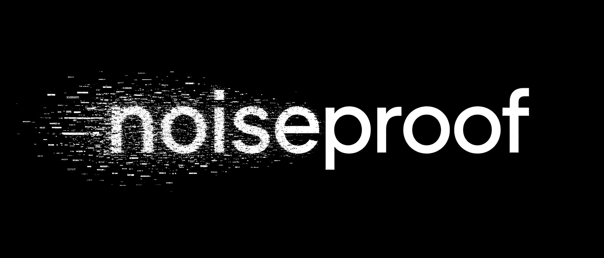
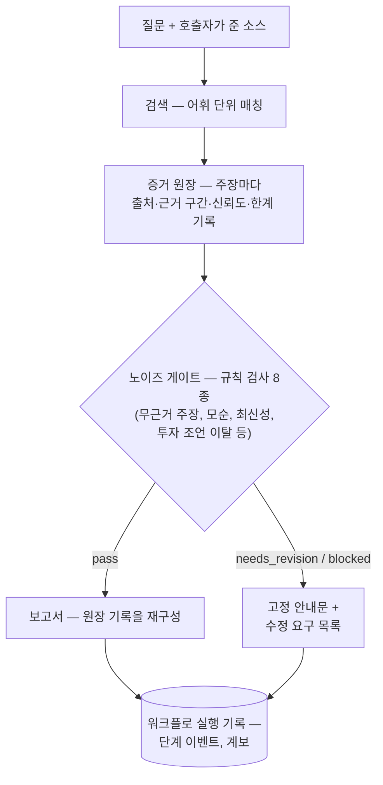

<p align="center">
  
</p>

**[English →](README.md)**

**NoiseProof Agent는 정제되지 않은 시장 문서를 읽고, 모든 주장을 출처·근거 구간·모순·판정 상태와 함께 기록하는 FastAPI 서비스다. 어떤 주장이 왜 통과했고 왜 차단됐는지를 기록으로 확인할 수 있다.**

- **끝까지 규칙 기반** — 기본 설정에서는 어떤 외부 모델도 호출하지 않는다. 외부 모델을 호출할 수 있는 코드 경로는 옵트인 OpenAI 임베딩 프로바이더(`NOISEPROOF_ENABLE_OPENAI_PROVIDER`) 하나뿐이다
- **증거 원장(Evidence Ledger)** — 주장마다 출처, 근거 구간, 신뢰도, 한계를 기록하고 supported / weakly_supported / contradicted / unsupported / blocked 중 하나로 판정한다
- **노이즈 게이트(Noise Gate)** — 원장 기록과 초안 주장에 규칙 검사를 돌려 pass, needs_revision, blocked를 결정한다. 차단되거나 수정이 필요하면 보고서 본문 대신 고정 안내문과 수정 요구 목록이 저장된다
- **트레이딩 봇이 아니다** — 매수·매도 조언을 하지 않는다([ADR 004](docs/adr/004-why-not-trading-bot.md), 영문). 투자 조언으로 흐르는 질문은 게이트의 투자 조언 검사가 차단한다
- **워크플로 실행 사슬** — 검색 → 원장 → 게이트 → 보고서. 계보, 단계별 이벤트, 실패 사례 기록, 그리고 단순 HTML 운영 대시보드가 남는다
- **문서 인테이크** — PDF/CSV/HTML/마크다운의 프로파일링, 파싱 미리보기, 청크 미리보기, 업로드를 지원한다. 디지털 PDF는 PyMuPDF로 추출하고 페이지 진단을 남긴다
- **검색 실행** — 호출자가 준 소스에 어휘 단위 매칭을 돌린다. 저장된 실행은 집계 지표(결과 수, 적중률, 인용 커버리지)를 남기고, 후보 청크는 응답으로 돌아온다
- **FastAPI + PostgreSQL(pgvector)** — 초기 스키마와 증분 마이그레이션을 작은 러너가 적용한다

<p align="center">
  <a href="https://github.com/svy04/noiseproof-agent/actions/workflows/ci.yml"></a>
  
</p>

<p align="center">
  <a href="#실행">실행</a> ·
  <a href="#주장이-지나는-길">주장이 지나는 길</a> ·
  <a href="#안-만든-것">안 만든 것</a> ·
  <a href="#구조">구조</a>
</p>

## 실행

Docker, Python 3.11 이상, uv가 필요하다.

```bash
cp .env.example .env
docker compose up -d db
cd apps/api
uv sync
uv run uvicorn app.main:app --reload
```

http://localhost:8000/health 와 http://localhost:8000/ops/dashboard 를 열면 동작을 확인할 수 있다. 핵심 엔드포인트의 curl 예시는 apps/api/README.md(영문)에 있다.

테스트는 CI와 같은 명령으로 돈다:

```bash
cd apps/api
uv run pytest -q
```

## 주장이 지나는 길

워크플로 실행 하나는 네 단계를 차례로 지난다. 단계마다 이벤트가 남고, 실패한 단계는 실패 기록을 남긴다.



게이트 판정이 pass가 아니면 보고서 본문은 만들어지지 않는다. 그 자리에는 고정 안내문과 수정 요구 목록이 저장된다.

## 안 만든 것

- **웹 UI 없음** — API와 서버 렌더링 대시보드가 인터페이스의 전부다
- **LLM 분석·보고서 작성 없음** — 초안 주장은 호출자가 넣고, 보고서는 원장 기록을 재구성한 것이다. docs/architecture.md의 analysis-draft 단계는 구현이 없다
- **기본 임베딩 생성 없음** — 시맨틱 엔드포인트는 호출자가 준 벡터의 순위를 매길 뿐이다. 해시 기반 미리보기 엔드포인트가 로컬 테스트용 결정적 벡터를 만들고, 품질 근거는 작은 로컬 픽스처가 전부다
- **OCR·표 추출은 실험** — 제품 기능이 아니라 평가 스크립트(packages/ingestion/pdf_quality)에 있다
- **호스팅 배포 없음** — 전부 로컬에서 돈다

## 구조

- `apps/api` — FastAPI 서비스와 테스트 스위트
- `packages/ingestion` — 파서(CSV·HTML·마크다운·PDF), 청킹, 검색, 증거 원장, 노이즈 게이트, PDF 품질 실험
- `packages/review` — 외부 피드백 이슈를 선별하는 CLI 도구
- `db` — 초기 스키마와 마이그레이션
- `examples` — 테스트와 평가 보고서가 쓰는 작은 픽스처
- `docs` — ADR, 스펙, 런북, 평가 보고서, 단계별 리뷰 노트

프로젝트는 작게 쪼갠 단계를 하나씩 검증하며 자랐고, 단계마다 리뷰 노트를 남겼다. docs/review에 파일이 수백 개인 이유가 그것이다.

docs/evaluation의 보고서는 apps/api/app/services의 명령이 재생성하고, 커밋된 보고서가 입력과 어긋나면 CI가 실패한다. 내용은 작은 로컬 픽스처와 실제 PDF 몇 건의 정제된 메타데이터지 벤치마크가 아니다.
