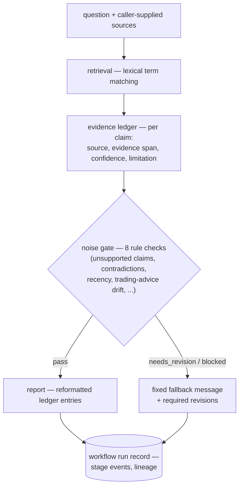

# NoiseProof Agent

**[한국어 문서 →](README.ko.md)**

**NoiseProof Agent is a FastAPI service that reads messy market documents and records every claim with its sources, evidence spans, contradictions, and a status — so you can see why a claim was accepted or blocked.**

- **Rule-based end to end** — in the default configuration nothing calls an external model; an opt-in OpenAI embedding provider (`NOISEPROOF_ENABLE_OPENAI_PROVIDER`) is the only code path that would
- **Evidence Ledger** — per-claim records: claim, source, evidence span, confidence, limitation, and a status of supported / weakly_supported / contradicted / unsupported / blocked
- **Noise Gate** — rule checks over ledger entries and draft claims deciding pass, needs_revision, or blocked; when the gate blocks or requires revision, the record stores a fixed fallback message and the required revisions instead of a report body
- **Not a trading bot** — no buy/sell advice ([ADR 004](docs/adr/004-why-not-trading-bot.md)); the gate's trading-advice check blocks questions that drift there
- **Chained workflow runs** — retrieval → ledger → gate → report, with lineage, stage events, failure-case records, and a plain HTML ops dashboard
- **Document intake** — profiling, parse preview, chunk preview, and upload for PDF/CSV/HTML/markdown; digital PDFs get PyMuPDF extraction with page diagnostics
- **Retrieval runs** — lexical term matching over caller-supplied sources; persisted runs keep aggregate metrics (result count, hit rate, citation coverage), candidate chunks return in the response
- **FastAPI + PostgreSQL (pgvector)** — initial schema plus incremental migrations applied by a small runner

<p align="center">
  <a href="https://github.com/svy04/noiseproof-agent/actions/workflows/ci.yml"></a>
  
</p>

<p align="center">
  <a href="#run-it">Run it</a> ·
  <a href="#how-a-claim-moves">How a claim moves</a> ·
  <a href="#know-what-is-not-built">What is not built</a> ·
  <a href="#find-your-way-around">Repo map</a>
</p>

## Run it

Requires Docker, Python 3.11+, and uv.

```bash
cp .env.example .env
docker compose up -d db
cd apps/api
uv sync
uv run uvicorn app.main:app --reload
```

Then open http://localhost:8000/health and http://localhost:8000/ops/dashboard. Example curl calls for the core endpoints are in apps/api/README.md.

Tests, with the same command CI runs:

```bash
cd apps/api
uv run pytest -q
```

## How a claim moves

A workflow run chains four stages. Each stage writes its own event, and a failing stage writes a failure record.



Unless the gate says pass, no report body is written. The stored record holds the fallback message and the list of required revisions instead.

## Know what is not built

- **No web UI** — the API plus the server-rendered dashboard are the interface
- **No LLM analysis or report writing** — draft claims come from the caller and reports reformat ledger entries; the analysis-draft stage in docs/architecture.md has no implementation
- **No model-generated embeddings by default** — semantic endpoints rank caller-supplied vectors; a hash-based preview endpoint produces deterministic vectors for local testing, and there is no quality evidence beyond small local fixtures
- **OCR and table extraction are experiments** — they live in evaluation scripts (packages/ingestion/pdf_quality), not product features
- **No hosted deployment** — everything runs locally

## Find your way around

- `apps/api` — the FastAPI service and its test suite
- `packages/ingestion` — parsers (CSV, HTML, markdown, PDF), chunking, retrieval, the evidence ledger, the noise gate, PDF-quality experiments
- `packages/review` — CLI helpers for screening external feedback issues
- `db` — initial schema and migrations
- `examples` — small fixtures used by tests and evaluation reports
- `docs` — ADRs, specs, runbook, evaluation reports, per-phase review notes

The project grew in many small, separately verified steps, and each step wrote its own review note — that is why docs/review holds several hundred files.

The reports under docs/evaluation are regenerated by commands in apps/api/app/services, and CI fails when a committed report no longer matches its inputs. They describe small local fixtures and sanitized metadata from a few real-world PDFs, not benchmarks.
